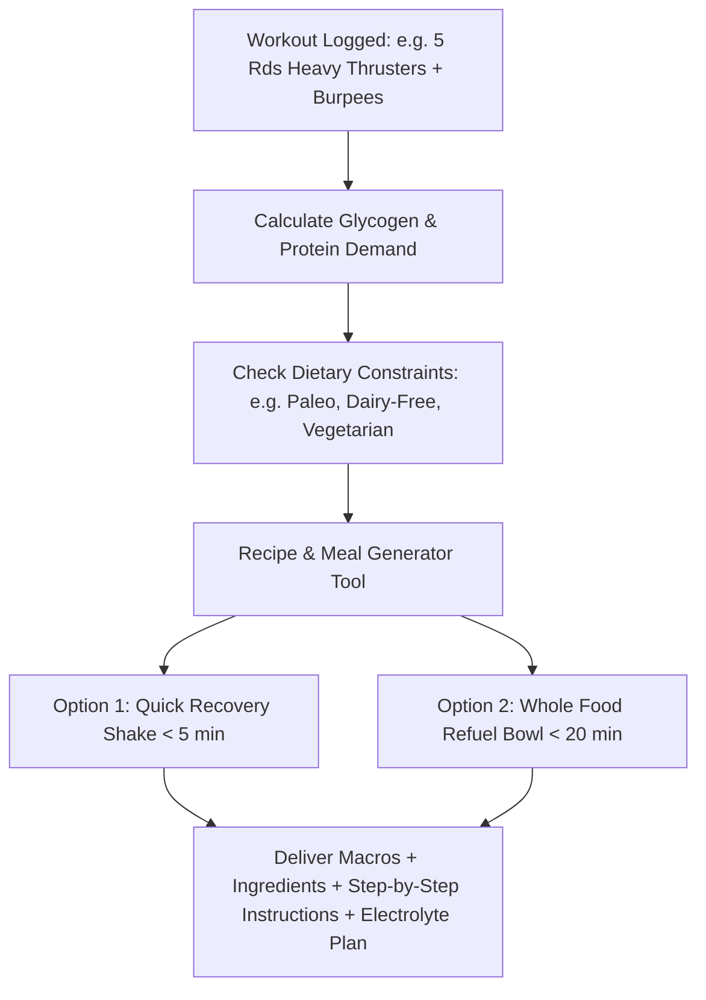
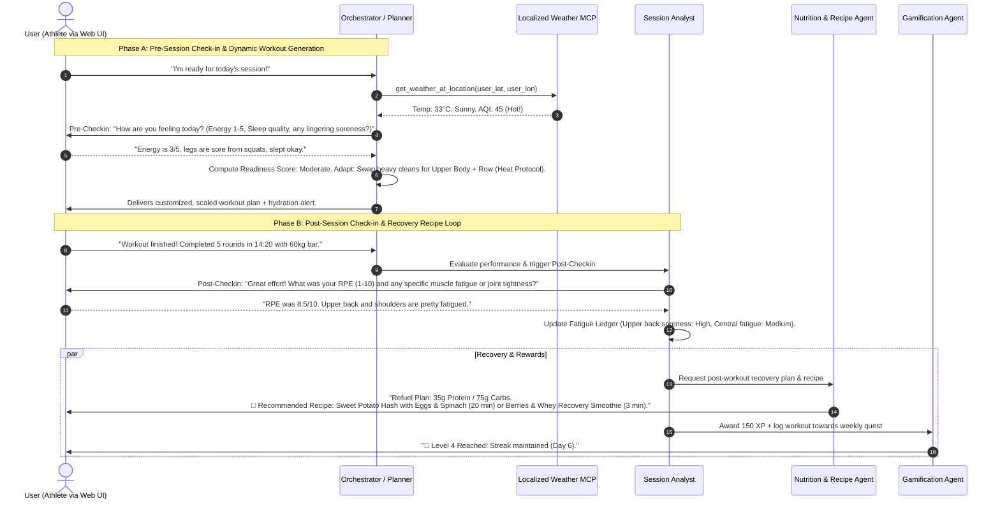

# Expert Fitness Coach Assistant with Google ADK: System Design & Implementation Plan (v5)

## Executive Summary & Architecture Vision

This implementation plan details the end-to-end architecture for an **Expert Fitness Coach Assistant** built on the **Google Agent Development Kit (ADK)** ([adk.dev](https://adk.dev)) and deployed on **Google Cloud Platform (GCP)**.

### Iteration 1 Core Features:
- **Web UI on Cloud Run via `--with_ui`**: Deploys with the exact same interactive web chat interface as `adk web` on local, providing an immediate shareable web app on GCP for testing and hackathons.
- **100% Gemini Flash Tier Across All Agents**: Standardized on Gemini Flash (`gemini-2.5-flash` / `gemini-2.0-flash`) for low latency, high throughput, and Google AI Studio free tier compatibility.
- **Conversational Readiness & Post-Session Check-ins**: Pre- and post-workout subjective feedback loops (RPE, soreness hotspots, sleep feel, energy level) to dynamically adapt training.
- **Post-Workout Recovery Recipes & Meal Engine**: In addition to macro calculations, the Dietitian Agent recommends practical, delicious post-workout recipes (e.g., 5-min recovery shakes, 20-min refuel bowls) tailored to dietary preferences (Paleo, Vegan, Omnivore, etc.) and the exact workout volume performed.
- **User Geolocation Weather Adaptation**: Real-time localized weather retrieval based on the athlete's coordinates/city to modify outdoor training (e.g., running vs rowing, hydration adjustments, extreme heat/cold protocols).
- **Curated Movement & Technique Knowledge**: Official CrossFit and athletic standards, scaling ladders, and verified movement demo videos.
- **Gamification & Behavioral Consistency**: PR tracking, skill progression trees, and anti-burnout streak systems.
- **Security & Privacy First**: Envelope encryption using Google Cloud KMS and in-memory PII sanitization.

```mermaid
graph TD
    User([User / Athlete Browser]) <--> CloudRun[Cloud Run: ADK Container + Web UI <br/> 🌐 adk deploy cloud_run --with_ui]
    
    subgraph "Google ADK Multi-Agent Orchestration Engine (Gemini Flash Tier)"
        Orchestrator[Fitness Orchestrator Agent <br/> ⚡ Gemini Flash]
        
        subgraph "Specialized Sub-Agents (⚡ Gemini Flash)"
            VaultAgent[1. Profile & Health Vault Agent <br/> ⚡ Flash]
            PlannerAgent[2. Adaptive Training Planner Agent <br/> ⚡ Flash]
            AnalystAgent[3. Session & Feedback Analyst Agent <br/> ⚡ Flash]
            KnowledgeAgent[4. Movement & Technique Research Agent <br/> ⚡ Flash]
            DietitianAgent[5. Nutrition, Fueling & Recipe Agent <br/> ⚡ Flash]
            GameAgent[6. Motivation & Gamification Agent <br/> ⚡ Flash]
        end
        
        Orchestrator --> VaultAgent
        Orchestrator --> PlannerAgent
        Orchestrator --> AnalystAgent
        Orchestrator --> KnowledgeAgent
        Orchestrator --> DietitianAgent
        Orchestrator --> GameAgent
    end

    subgraph "MCP Servers & External Tools"
        MCP_Weather[MCP: Localized Weather & Environmental AQI]
        MCP_CrossFit[MCP: CrossFit Standards & Video Library]
        MCP_Gamification[MCP: Quests, Streaks & PR Badges]
        Tools_Nutrition[Tools: ISSN Macros & Post-Workout Recipe Engine]
        Tools_Readiness[Tools: Subjective Check-in & Fatigue Matrix]
    end

    PlannerAgent --- MCP_Weather
    PlannerAgent --- Tools_Readiness
    AnalystAgent --- Tools_Readiness
    KnowledgeAgent --- MCP_CrossFit
    DietitianAgent --- Tools_Nutrition
    GameAgent --- MCP_Gamification

    subgraph "Google Cloud Platform Infrastructure"
        VertexAI[Vertex AI / Google AI Studio: Gemini Flash]
        KMS[Cloud KMS: Envelope Encryption DEK/KEK]
        Firestore[Cloud Firestore: Encrypted User Vault & Workout Logs]
        Redis[Memorystore Redis: ADK Session & Active State]
    end

    CloudRun -.-> VertexAI
    VaultAgent -.-> KMS
    VaultAgent -.-> Firestore
    CloudRun -.-> Redis
```



---

## 1. Web Interface & Deployment Modes on Google Cloud Run

### 1.1 Mode A: Built-in ADK Web UI (Same as `adk web` on local)
- When deploying to Google Cloud Run, passing the `--with_ui` flag packages and serves the **exact same interactive Web UI** directly from the Cloud Run URL (e.g. `https://fitness-coach-xxxx.a.run.app`).
- **Use Case**: Instant access, hackathon demos, pairing/user testing with zero frontend development needed.
- **Deployment Command**:
  ```bash
  adk deploy cloud_run \
    --project_id=$GCP_PROJECT \
    --region=us-central1 \
    --service_name=fitness-coach-assistant \
    --with_ui \
    --session_service_uri=redis://$REDIS_IP:6379
  ```

### 1.2 Mode B: Headless API Mode (Custom Clients)
- Omission of `--with_ui` runs a lightweight headless FastAPI / SSE server for connecting custom React, Flutter, or mobile frontends.

---

## 2. Multi-Agent Topology & Agent Specifications

All agents are configured with `gemini-flash` for high-throughput, deterministic execution and zero API cost under free tiers:

| Agent Name | Model Tier | Core Responsibilities | Key Tools / MCPs |
| :--- | :---: | :--- | :--- |
| **`FitnessOrchestratorAgent`** | **Gemini Flash** | Conversational front-door; intent classification; multi-agent dispatch; response synthesis with an encouraging, expert coaching persona. | `ADK SessionService`, `ADK MemoryService` |
| **`ProfileVaultAgent`** | **Gemini Flash** | Secure profile management (age, gender, height, weight, dietary preferences/allergies, injury history, geolocation). PII sanitization and KMS encryption. | `KmsCryptoTool`, `ProfileValidatorTool`, `LocationResolverTool` |
| **`AdaptivePlannerAgent`** | **Gemini Flash** | Workout programming; runs **Pre-Session Check-in** (energy, soreness, sleep) + localized weather check to adapt movements and loading. | `WeatherMCP`, `PreSessionCheckinTool`, `PeriodizationTool`, `CrossFitKnowledgeMCP` |
| **`SessionAnalystAgent`** | **Gemini Flash** | Post-workout evaluation; runs **Post-Session Check-in** (RPE 1-10, muscle fatigue hotspots); logs training volume & updates recovery ledger. | `PostSessionCheckinTool`, `TonnageCalculatorTool`, `GamificationMCP` |
| **`MovementResearchAgent`** | **Gemini Flash** | Retrieves verified CrossFit movement standards, setup cues, scaling alternatives, and verified video demo links. | `CrossFitKnowledgeMCP`, `YouTubeSearchTool` |
| **`NutritionFuelingAgent`** | **Gemini Flash** | Calculates TDEE + workout burn; provides daily macro splits; **generates tailored post-workout recipes & meal options** matching specific dietary styles. | `TDEECalculatorTool`, `MacroSplitTool`, `RecipeGeneratorTool`, `HydrationCalculatorTool` |
| **`GamificationAgent`** | **Gemini Flash** | Manages XP, level progression, PR tracking (1RM, benchmark times), streak maintenance with "Freeze Tokens", and weekly fitness quests. | `GamificationMCP`, `MilestoneEvaluatorTool` |

---

## 3. Post-Workout Nutrition & Recipe Recommender Engine

The `NutritionFuelingAgent` generates actionable, tasty, and macro-matched post-workout meals based on training intensity and dietary restrictions:



### 3.1 Recipe Generation Parameters
- **Dietary Styles Supported**: Omnivore, Paleo, Clean Eating, Vegetarian, Vegan, Gluten-Free, Dairy-Free, Low-FODMAP.
- **Preparation Speed Options**:
  - *Quick Shake / Grab-and-Go (< 5 mins)*: Whey/plant protein + banana + honey/oats + coconut water + pinch of sea salt.
  - *Complete Recovery Meal (15–25 mins)*: e.g. Honey-Sriracha Salmon / Chicken Quinoa Bowl with roasted sweet potatoes, avocado, and spinach.
- **Nutrient Match Guarantee**:
  - Exact target grams of Protein, Carbohydrates, and Fats computed for the athlete.
  - Key recovery micronutrients highlighted (e.g., Potassium, Magnesium, Sodium for electrolyte rehydration, Tart Cherry / Curcumin for inflammation).

---

## 4. Dual Conversational Feedback Loops: Pre-Session & Post-Session



---

## 5. Localized Weather Engine & Environmental Adaptation

- **Location Resolution**: Coordinates or City passed via user profile / UI session state.
- **Weather Service**: FastMCP querying Open-Meteo / OpenWeatherMap.
- **Adaptive Triggers**:
  - *Heat Index $\ge 32^\circ\text{C}$ ($90^\circ\text{F}$)*: Replaces outdoor runs with Concept2 Rowers or Echo Bikes; prompts $+500\text{ml}$ water + sodium.
  - *Rain / Ice*: Replaces outdoor movements with indoor burpees, box jumps, or double unders.
  - *AQI $> 150$*: Restricts workouts strictly indoors with moderate respiratory demand.

---

## 6. Movement Knowledge & Official CrossFit Content Strategy

1. **Pre-Indexed Knowledge Catalog (`data/movements_seed.json`)**:
   - 9 Foundational CrossFit Movements + Olympic Lifts + Gymnastics.
   - Structured fields: Setup, Execution, Points of Performance, Common Faults & Corrections, Scaled Variations, Official Video Embed URL.
2. **Verified Video Linking**:
   - Verified YouTube video IDs from official channels (`@CrossFit`, `@USAWeightlifting`, `@CrossFitTraining`).

---

## 7. Gamification Engine

- **XP & Levels**: Base workout $+100\text{ XP}$, Post-workout check-in $+25\text{ XP}$, PR $+150\text{ XP}$.
- **Skill Progression Trees**: Kipping $\rightarrow$ Chest-to-Bar $\rightarrow$ Bar Muscle-Up $\rightarrow$ Ring Muscle-Up.
- **Streaks & Protection**: Rest/recovery days maintain streak; 2 "Streak Freeze Tokens" per month.

---

## 8. Data Privacy & Security

- **Envelope Encryption**: Biometrics & profile encrypted at rest using AES-256-GCM + Google Cloud KMS.
- **PII Sanitization**: Strips names/emails before feeding prompts to Gemini Flash.
- **Safety Filters**: Automatic medical disclaimers if sharp joint pain or injury symptoms are reported.

---

## 9. Google Cloud Deployment Architecture

- **Runtime**: Cloud Run (v2) with Python 3.12 + `google-adk`.
- **UI Flag**: Deploying with `--with_ui` enables the full web chat UI in production.
- **State & Memory**: Memorystore Redis (ADK `SessionService`) + Cloud Firestore (encrypted vault).
- **Deployment Command**:
  ```bash
  adk deploy cloud_run \
    --project_id=$GCP_PROJECT \
    --region=us-central1 \
    --service_name=fitness-coach-assistant \
    --with_ui \
    --session_service_uri=redis://$REDIS_IP:6379
  ```

---

## 10. Verification & Test Plan

1. **Automated Testing (`pytest`)**:
   - `test_recipes.py`: Test recipe generation matching macro targets across Paleo, Vegan, and Omnivore diets.
   - `test_pre_post_checkin.py`: Test fatigue scoring matrix and dynamic adaptations.
   - `test_weather_adaptation.py`: Test localized weather query and indoor/outdoor substitutions.
   - `test_crypto.py`: Test KMS envelope encryption and PII stripping.
2. **Interactive Web Simulation**:
   - Run `adk web` locally (or test deployed Cloud Run URL with `--with_ui`) to execute complete onboarding $\rightarrow$ Pre-session check-in $\rightarrow$ Workout delivery $\rightarrow$ Post-session check-in $\rightarrow$ Recipe & refuel recommendation $\rightarrow$ XP celebration.
